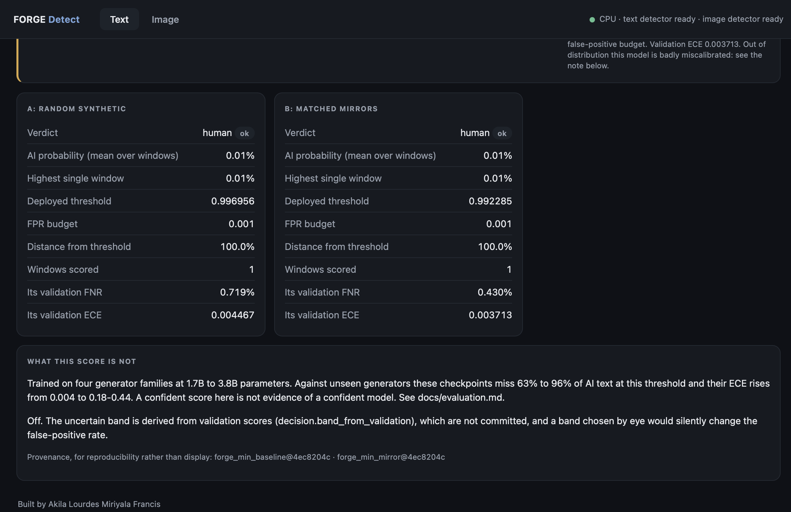
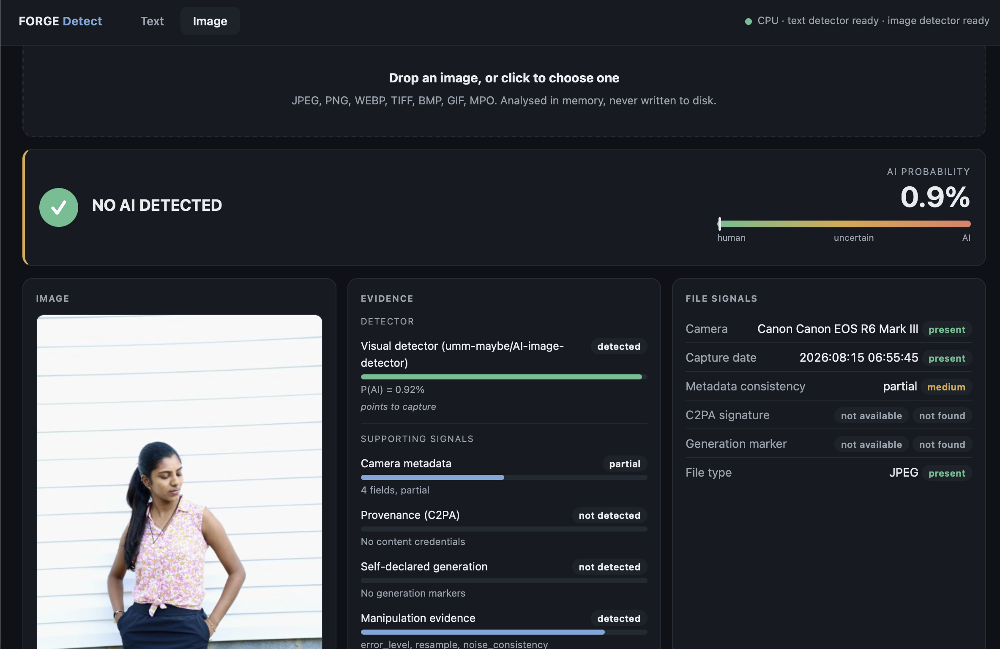
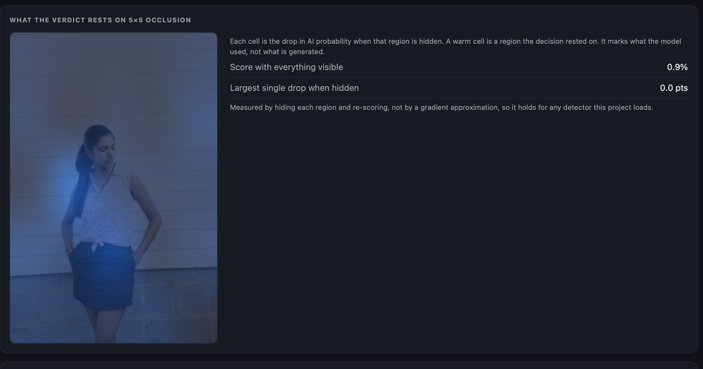

<div align="center">


### *Built by* **Akila Lourdes Miriyala Francis**

<p align="center">
  
  
  
  
  
</p>

<p align="center">
  
  
  
  
</p>

<p align="center">
  <a href="https://panagramforge-cqzwwskdjhbfv6hxwppvkz.streamlit.app"><b>▶ Live demo</b></a> ·
  <a href="docs/evaluation.md"><b>Evaluation</b></a> ·
  <a href="docs/writeup.md"><b>Writeup</b></a> ·
  <a href="docs/model_card.md"><b>Model card</b></a>
</p>

<br/>

> **A controlled experiment, not a product claim.** Two detectors were trained that differ
> in exactly one thing: how their synthetic training half was produced. Everything else,
> the human corpus, the backbone, the schedule, the seed and the false-positive budget, was
> held fixed. This repository reports what that changed, including where it changed nothing.

<br/>

</div>

---

## 🎯 The Question

Detectors are trained on synthetic text somebody had to generate. Almost everyone generates
it the easy way: prompt a model for essays on assorted topics and label them AI. FORGE asks
whether generating synthetic text that **mirrors real human documents**, matched on topic,
length, register and structure, produces a detector that survives contact with generators it
has never seen.

| | Arm A · control | Arm B · treatment |
|---|---|---|
| Human half | FineWeb, identical | FineWeb, identical |
| Synthetic half | **randomly prompted** generations | **matched mirrors** of the human documents |
| Backbone | DeBERTa-v3-base | DeBERTa-v3-base |
| Precision, schedule, seed, budget | identical | identical |

One variable. That is the whole design, and it is the reason the numbers below mean
anything.

---

## 📊 What Actually Happened

### In distribution, the two arms are the same detector

| Metric | Arm A · random | Arm B · mirrors |
|---|---|---|
| AUROC | 0.999974 | 0.999971 |
| FNR at the 0.1% FPR budget | 0.719% | **0.430%** |
| Expected calibration error | 0.004467 | **0.003713** |
| Deployed threshold | 0.996956 | 0.992285 |
| Realised FPR | 0.0502% | 0.0502% |

Both are essentially perfect on held-out data from their own distribution, which is exactly
why in-distribution numbers are not evidence of anything.

### Out of distribution, the picture splits three ways

Every arm evaluated on 4,000 documents per benchmark, 2,000 human and 2,000 AI, at the
threshold each arm actually deploys.

| Benchmark | AUROC · A | AUROC · B | Miss rate · A | Miss rate · B | ECE · A | ECE · B |
|---|---|---|---|---|---|---|
| **HC3** | 0.658 | **0.885** | 94.0% | **62.9%** | 0.423 | **0.183** |
| **RAID** | 0.779 | 0.776 | 82.5% | **78.0%** | 0.372 | 0.354 |
| **MAGE** | 0.588 | 0.628 | 96.1% | 86.7% | 0.441 | 0.381 |

### The test that decides it

AUROC compares rankings. A detector is deployed at an operating point. So each arm's
threshold was re-fit to spend the **same** human false-positive budget, and McNemar's test
run on the discordant pairs, because both arms score the *same documents* and their errors
are correlated.

| Benchmark | B catches, A misses | A catches, B misses | χ² | p |
|---|---|---|---|---|
| **HC3** | **119** | 39 | 39.50 | 3.3 × 10⁻¹⁰ |
| **RAID** | **122** | 9 | 95.76 | < 10⁻¹⁵ |
| **MAGE** | 28 | 19 | 1.36 | **0.243** |

**The finding, stated honestly.** On HC3 the mirror arm is better by every measure. On RAID
the two arms have *identical AUROC*, and the sign of that difference reverses in **72.7% of
10,000 paired bootstrap resamples**, yet at a matched budget the mirror arm catches 122
documents the control misses against 9 the other way. Mirroring moved the low-false-positive
tail without moving the ranking. On MAGE it did nothing at all.

### The limitation, in the same breath

> Neither arm is deployable out of distribution. Against unseen generators both miss
> **63% to 96%** of AI text at their deployed threshold, and calibration collapses from
> ECE 0.004 in distribution to **0.18 – 0.44** outside it. A confident score from this
> system is not evidence of a confident model. The live demo will show you this if you
> paste in ChatGPT output, and the page says so rather than hiding it.

---

## 🖥️ The Interface

<div align="center">

<br/>
<em>Both arms scored on the same document, with the deployed threshold marked on the gauge and the limitation stated under the result</em>
</div>

<br/>

<div align="center">

<br/>
<em>Image tab: declaration-first verdict logic, evidence streams, and a forensic breakdown that never invents a score</em>
</div>

<br/>

<div align="center">

<br/>
<em>Occlusion attribution over the detector's own tensor space, and eleven transforms re-scored to test whether the verdict survives redistribution</em>
</div>

### Three design rules the interface never breaks

| Rule | Why |
|---|---|
| **"NO AI DETECTED", never "HUMAN"** | A detector cannot establish that a person wrote something. It reports whether the input resembles the distribution it was trained on. One is a claim about the world, the other about the model. |
| **A declaration outranks a probability** | An IPTC `trainedAlgorithmicMedia` tag or a Stable Diffusion parameter block is a label the generator wrote about its own output. A mediocre detector does not get to overrule it. |
| **Absence is reported as absence** | No EXIF means the file has no EXIF. It does not mean AI. Metadata-derived scores fire hardest on screenshots and re-saved photographs, which is precisely the false accusation this project exists to prevent. |

---

## 🏗️ Pipeline

```
FineWeb / FineWeb-Edu
        │
        ▼
┌────────────────────────────────────────────────┐
│  Ingestion & cleaning                          │
│  • language id · PII scrub · normalisation     │
│  • MinHash + exact dedup                       │
│  • source-group splits (no leakage across arms)│
└───────────────────┬────────────────────────────┘
                    │  FORGE-HUMAN corpus
        ┌───────────┴───────────┐
        ▼                       ▼
┌────────────────┐      ┌────────────────────────┐
│  ARM A         │      │  ARM B                 │
│  random prompts│      │  mirror engine         │
│                │      │  • attribute extraction│
│                │      │  • generator pinning   │
│                │      │  • length matching     │
└───────┬────────┘      └───────────┬────────────┘
        │                           │
        └───────────┬───────────────┘
                    ▼
┌────────────────────────────────────────────────┐
│  Training · DeBERTa-v3-base, bf16, RTX 4090    │
│  • windowed scoring, mean-pooled               │
│  • checkpoint chosen by FNR *inside* the       │
│    FPR budget, not by the budget itself        │
│  • temperature calibration on validation       │
└───────────────────┬────────────────────────────┘
                    ▼
┌────────────────────────────────────────────────┐
│  Evaluation                                    │
│  • in-distribution + HC3 / MAGE / RAID         │
│  • paired bootstrap · McNemar at matched budget│
│  • calibration under shift (ECE)               │
│  • every run record committed to reports/      │
└───────────────────┬────────────────────────────┘
                    ▼
        Serving · CPU, float32, two shells
        FastAPI reference page · Streamlit deploy
```

---

## 🔧 Components

### `src/forge/generation/mirror.py` — the treatment
Extracts attributes from a human document (topic, length, register, structure), pins a
generator, and produces a synthetic counterpart matched on all of them. This is the single
variable the experiment manipulates.

### `src/forge/training/train.py` — checkpoint selection that actually selects
The original selector scored checkpoints by FPR-at-budget, which is **pinned by construction**
to the budget: every epoch produced the same number, `<=` handed the win to the last one, and
`best.pt` was byte-identical to `last.pt`. Selection now prefers a checkpoint inside the
budget and breaks ties on FNR, the thing the project is trying to minimise.

### `src/forge/evaluation/ood.py` + `scripts/ood_mcnemar.py` — the statistics
The first significance test was a two-proportion z-test on FNRs measured at **two different
thresholds**, treating paired data as independent samples. It reported p = 0.0 on MAGE. The
paired McNemar at a matched budget reports **p = 0.243**. The replacement changed a headline
claim, which is the point of doing it properly.

### `src/forge/inference/scorer.py` — the CPU serving path
Loads an arm, windows the document, mean-pools. Contains one line that matters more than it
looks: `model.float()`. Training ran in bf16, and CPU matmul refuses to mix Half and Float,
so without it *no text scored at all* on the only hardware this path targets.

### `src/forge/image/detector.py` — polarity resolved by measurement
Which class a third-party model calls "AI" is read from labelled images, never from its
`id2label` documentation. A detector whose polarity is unverified reports that it is
unverified instead of producing a possibly inverted verdict.

### `src/forge/image/attribution.py` — occlusion, not saliency
Hides each region of a 5×5 grid, re-scores in one batched forward pass, and maps the drop in
AI probability. Measured rather than gradient-approximated, so it holds for any detector the
project loads.

### `src/forge/ui/` — one template, two shells
The FastAPI page and the Streamlit page render the same cards from the same payload against
the same stylesheet. Two renderers over one payload is how pages drift into disagreeing with
themselves, so there is exactly one of each.

---

## 🧪 What the Test Suite Is For

**918 tests**, and the interesting ones are not unit tests. They are regression tests, each
named after a specific wrong answer this project shipped and then caught:

| Test | The failure it locks out |
|---|---|
| `test_a_half_precision_checkpoint_still_scores_on_cpu` | bf16 weights on CPU: no text scored at all |
| `test_the_best_checkpoint_is_not_simply_the_last_one` | selection metric pinned by construction |
| `test_a_phone_photograph_in_an_mpo_container_is_analysed_not_rejected` | an allowlist refusing real Canon photographs |
| `test_no_shipped_string_says_the_visual_detector_does_not_exist` | the payload denying a detector that had just scored |
| `test_the_serve_extra_can_actually_serve` | an install that booted with no model stack |
| `test_the_gauge_marks_the_threshold_the_verdict_actually_uses` | a gauge implying a 50% boundary against a 0.992 threshold |

The pattern behind every one of them is the same: **something reported a state it was not
measuring**. That is also the failure mode detection products die of, which is why the tests
are written as narratives rather than assertions.

---

## 🚀 Run It

### Live
**https://panagramforge-cqzwwskdjhbfv6hxwppvkz.streamlit.app**

### Locally
```bash
git clone git@github.com:AKilalours/Panagram_Forge.git
cd Panagram_Forge
python -m venv .venv && source .venv/bin/activate
pip install -e ".[serve,image,dev]"
```

```bash
# The reference interface
python -m uvicorn api.forge_app:app --port 8000

# The deployed interface
streamlit run streamlit_app.py

# Everything, including the regression suite
python -m pytest -q
```

Text checkpoints are fetched from
[`Akilalourdes/forge-detect-weights`](https://huggingface.co/Akilalourdes/forge-detect-weights)
on first use. Serving is CPU-only; no GPU is required to reproduce any inference result.

### Reproducing the evaluation without a GPU
```bash
python scripts/eval_ood.py --arm mirror --benchmark raid
python scripts/ood_mcnemar.py
python scripts/ood_table.py
```
Every figure in this README is read from a committed record under `reports/experiments/`.
Nothing here is typed in by hand.

---

## 🔬 Tech Stack

| Layer | Technology |
|---|---|
| Backbone | `microsoft/deberta-v3-base` |
| Training | PyTorch, bf16, NVIDIA RTX 4090 on RunPod, ~21 min per arm |
| Corpus | FineWeb / FineWeb-Edu, MinHash dedup, source-group splits |
| Benchmarks | HC3 · MAGE · RAID, evaluation-only |
| Statistics | paired bootstrap (10k resamples), McNemar at a matched budget |
| Serving | FastAPI · Streamlit · CPU float32 |
| Image forensics | Pillow, C2PA / IPTC parsing, ELA, resampling, quantisation tables |
| Weights | Hugging Face Hub |

---

## 📁 Structure

```
Panagram_Forge/
├── src/forge/
│   ├── generation/         # mirror engine: the experiment's one variable
│   ├── training/           # training loop, checkpoint selection, calibration
│   ├── evaluation/         # OOD harness, metrics, calibration, release gate
│   ├── inference/          # CPU scorer, decision policy, shared text API
│   ├── image/              # detector, forensics, occlusion attribution
│   ├── ui/                 # ONE stylesheet and ONE set of result cards
│   ├── dedup/ cleaning/    # MinHash, exact dedup, PII, language id
│   └── failure_atlas/      # clustering of what the detector gets wrong
├── api/forge_app.py        # FastAPI reference interface
├── streamlit_app.py        # deployed interface
├── scripts/                # eval_ood · ood_mcnemar · image_detector_probe · …
├── reports/experiments/    # every committed run record and score array
├── docs/                   # evaluation · writeup · model card · data spec
├── demo/                   # held-in AI samples for testing the text tab
└── tests/unit/             # 918 tests, most named after a real bug
```

---

## ⚠️ Honest Scope

| Claim | Status |
|---|---|
| Two arms trained and compared under one changed variable | ✅ done, records committed |
| Mirroring helps at low FPR on HC3 and RAID | ✅ measured, McNemar at matched budget |
| Mirroring helps on MAGE | ❌ **no effect**, p = 0.243 |
| Either arm is deployable out of distribution | ❌ **no**, 63–96% miss rate |
| Image side is a trained FORGE model | ❌ **no**, a measured third-party baseline |
| Image operating point is validated | ❌ fitted in sample on 20 generated and 9 human images |
| Arms C (hard negatives) and D (adversarial) | ⏳ wired, not yet trained |

---

## 💡 One-Liner

> *"Trained two DeBERTa-v3 detectors differing only in how their synthetic half was
> generated, and tested the difference properly: paired bootstrap and McNemar at a matched
> 0.1% false-positive budget. Mirrored synthetic data cut the HC3 miss rate from 94% to 63%
> and caught 122 RAID documents the control missed, while doing nothing measurable on MAGE.
> Both arms remain undeployable out of distribution, and the shipped interface says so."*

---

<div align="center">


**© 2026 Akila Lourdes Miriyala Francis**

*DeBERTa-v3 · PyTorch · FastAPI · Streamlit · HC3 · MAGE · RAID · FineWeb*

</div>
